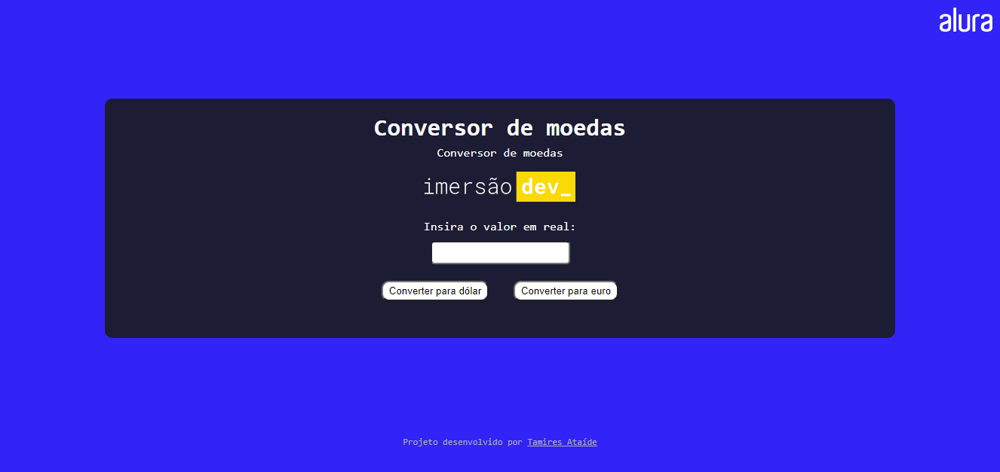

# ImersãoDev Alura - Conversor de moedas

Esse conversor de moedas foi desenvolvido como o primeiro projeto da ImersãoDev realizada pela Alura, no período de 07/03/2022 a 18/03/2022

## ÍNDICE

- [Resumo](#resumo)
- [Screenshot](#screenshot)
- [Links](#links)
- [O que eu aprendi](#o-que-eu-aprendi)
- [Autor](#autor)

### Resumo

A partir das aulas foi possível desenvolver o projeto de um conversor, fazendo o uso de JavaScript. Apesar do código HTML e CSS ter sido disponibilizado já pronto, os professores incentivaram os alunos a explorarem e alterarem os sites de forma a criar diferentes tipos de conversores.

### Screenshot

### Links
-  [Codepen](https://codepen.io/tamiresataide/pen/oNpvpbp)

### O que eu aprendi

Esse projeto foi uma ótima forma de ver os conceitos básicos de JavaScript aplicados a um projeto funcional. Apesar de simples, foi possível ver diversos conceitos essenciais como variáveis, funções, como criar e aplicar funções no HTML, conversão de tipos de dados, entre muitos outros conceitos fundamentais. 

### Autor

- [Linkedin](https://linkedin.com/in/tamiresataide)
- [Github](https://github.com/tamiresataide)

